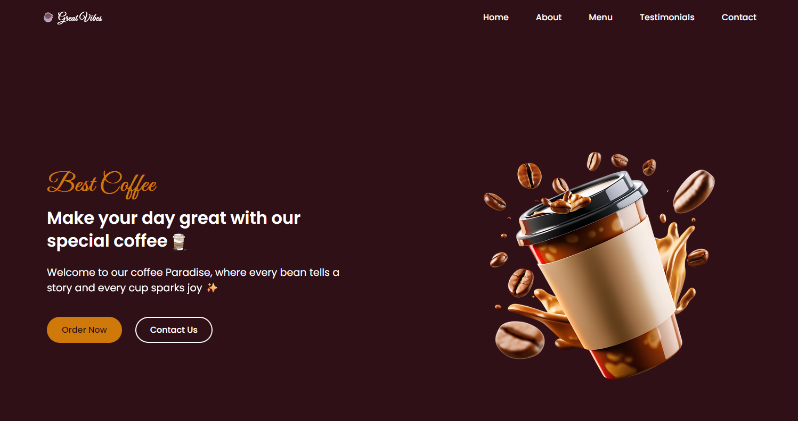
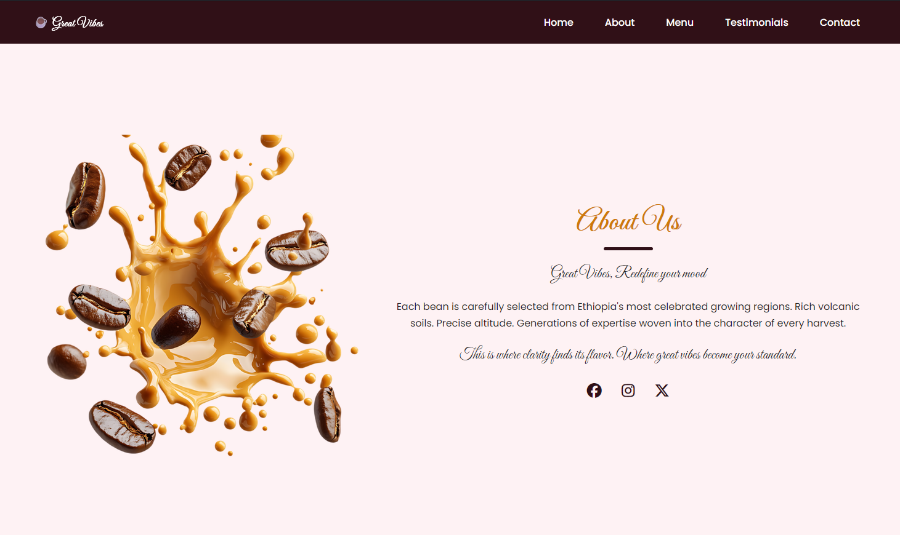
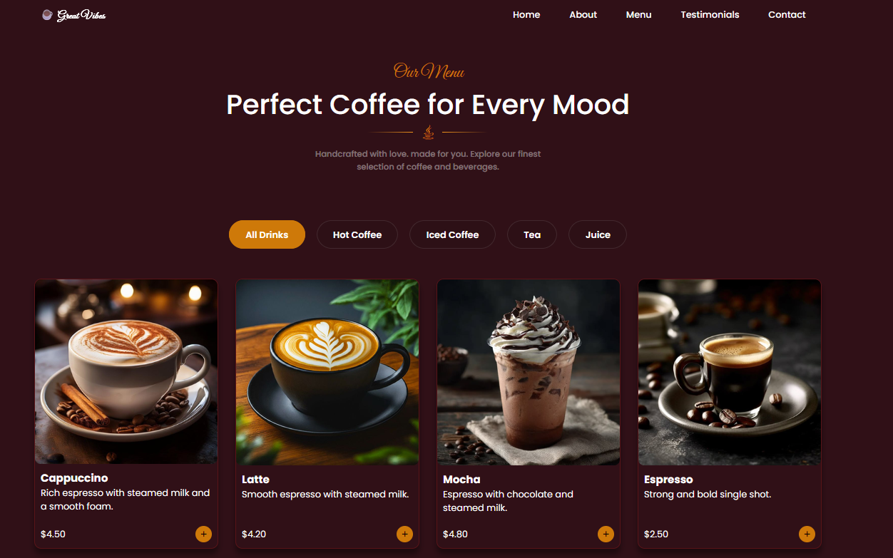

# Great Vibes Coffee Shop

Welcome to the Great Vibes Coffee Shop project! This is a modern, responsive website for a specialty coffee shop located in Addis Ababa.

## Technologies Used

This project was built from the ground up using standard front-end technologies:

- **HTML5**: For structuring the content and semantic elements.
- **CSS3**: For styling, custom animations, responsive layouts (Flexbox and Grid), and variables to manage the theme.
- **Vanilla JavaScript**: For interactive elements like the mobile navigation menu and filtering the coffee drinks on the menu.
- **FontAwesome**: For the icons used throughout the site.
- **Google Fonts**: Custom typography using 'Poppins' and 'Great Vibes' fonts.

## Screenshots

Here are some glimpses of the website sections:

### Hero Sections

### About Section

### Menu Sections

## Getting Started

To view the project locally, simply clone or download the repository and open the `index.html` file in any modern web browser. No complex build tools, package managers, or server-side setups are required!